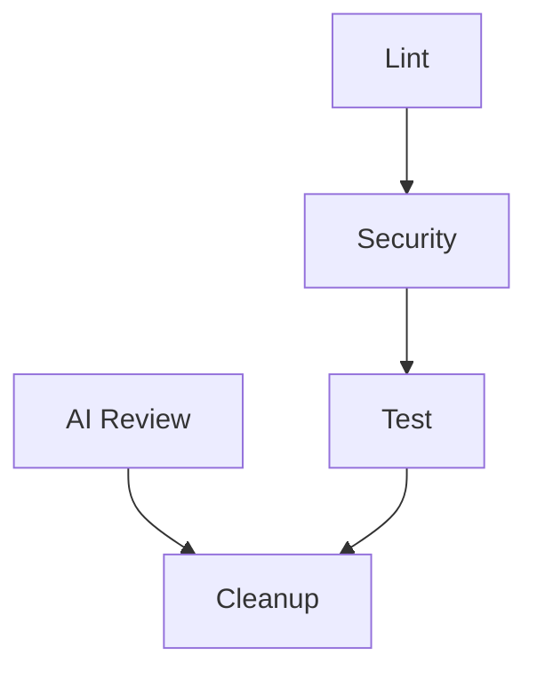

# CI/CD Pipeline Documentation

Active Interview Service uses separate Continuous Integration (CI) and Continuous Deployment (CD) workflows to ensure code quality and automated deployments.

## Pipeline Overview

```
┌──────────┐     ┌──────────┐     ┌──────────┐
│   Push   │ ──> │   CI     │ ──> │   CD     │
│ to main  │     │ Pipeline │     │ Pipeline │
└──────────┘     └──────────┘     └──────────┘
                      │                 │
                      ├─ Lint           └─ Deploy to
                      ├─ Security          Railway
                      ├─ Test
                      ├─ Coverage
                      └─ AI Review
```

## Continuous Integration (`CI.yml`)

**File:** `.github/workflows/CI.yml`

### Triggers

- Push to `main` branch
- Pull requests to `main`
- Manual dispatch via GitHub Actions UI

### Jobs Overview



---

### 1. Lint Job

**Purpose:** Code quality checks

**Steps:**
- Python linting with `flake8`
- Django template linting with `djlint`
- Outputs results to GitHub Step Summary

**Linting Standards:**
- **flake8:** PEP 8 compliance, configured via `.flake8`
- **djlint:** Django template best practices

**Local equivalent:**
```bash
# From active_interview_backend/
flake8 --config .flake8 .
djlint --configuration djlint.toml active_interview_app/templates/ --lint
```

---

### 2. Security Job

**Purpose:** Security vulnerability scanning

**Depends on:** Lint job

**Steps:**
- Dependency vulnerability scanning with `safety`
- Static code analysis with `bandit`
- Generates JSON reports
- Uploads reports as artifacts (14-day retention)

**What it checks:**
- **safety:** Known vulnerabilities in Python packages
- **bandit:** Security issues in code (SQL injection, hardcoded secrets, etc.)

**Local equivalent:**
```bash
pip install safety bandit
safety check --json
bandit -r . -f json
```

---

### 3. Test Job

**Purpose:** Run Django tests with coverage validation

**Depends on:** Security job

**Environment:**
- Docker containers (`docker-compose.prod.yml`)
- Python 3.12
- Chrome 135.0.7049.52-1
- Chromedriver 135.0.7049.52
- PostgreSQL test database

**Steps:**
1. Checkout code
2. Start Docker containers
3. Install Chrome and Chromedriver
4. Run Django test suite with coverage
5. Enforce **minimum 80% code coverage**
6. Upload coverage reports as artifacts
7. Clean up Docker resources

**Coverage requirement:**
```bash
# Tests MUST achieve ≥80% coverage or CI fails
TOTAL coverage ≥ 80%
```

**Artifacts created:**
- `coverage-report` (text)
- `coverage-html` (interactive HTML report)
- Retention: 14 days

**Local equivalent:**
```bash
docker-compose -f docker-compose.prod.yml up -d --build
docker exec django python3 manage.py test
docker exec django coverage run manage.py test
docker exec django coverage report -m
```

---

### 4. AI Review Job

**Purpose:** Automated code review using OpenAI

**Runs in parallel** with other jobs

**Steps:**
1. Analyze git diffs from pushes/PRs
2. Generate AI-powered code review feedback
3. Upload review reports as artifacts
4. Add review summary to GitHub Step Summary

**What it reviews:**
- Code quality and best practices
- Potential bugs or issues
- Suggestions for improvement
- Security concerns

**Artifacts:**
- `ai-code-review` report
- Retention: 14 days

**Requirements:**
- `OPENAI_API_KEY` GitHub secret

---

### 5. Cleanup Job

**Purpose:** Archive and consolidate reports

**Runs after:** All other jobs complete

**Steps:**
1. Download all artifacts from previous jobs
2. Create compressed archive of essential files:
   - Coverage reports
   - Security scan results
   - AI review feedback
3. Upload consolidated archive (30-day retention)
4. Generate cleanup summary

**Final artifact:**
- `essential-reports.zip`
- Retention: 30 days

---

## Continuous Deployment (`CD.yml`)

**File:** `.github/workflows/CD.yml`

### Triggers

- Push to `prod` or `main` branches
- Manual dispatch via GitHub Actions UI

### Deployment Flow

```
┌─────────────┐
│ Code pushed │
│  to main    │
└──────┬──────┘
       │
       v
┌─────────────┐
│   Deploy    │
│   to        │
│  Railway    │
└──────┬──────┘
       │
       v
┌─────────────┐
│ Production  │
│   Live!     │
└─────────────┘
```

### Deploy Job

**Steps:**
1. Checkout code
2. Install Railway CLI via npm
3. Authenticate using `RAILWAY_TOKEN`
4. Deploy to service specified by `RAILWAY_SERVICE_ID`
5. Generate deployment summary

**Deployment details:**
- Platform: Railway
- Method: `railway up` (CLI)
- Target: Service specified by `RAILWAY_SERVICE_ID`

**Deployment summary includes:**
- Status (success/failure)
- Branch deployed
- Commit SHA
- Timestamp

---

## Required GitHub Secrets

### For CI Pipeline

| Secret | Purpose | How to get |
|--------|---------|------------|
| `DJANGO_SECRET_KEY` | Django secret for test environment | Generate: `python -c "from django.core.management.utils import get_random_secret_key; print(get_random_secret_key())"` |
| `OPENAI_API_KEY` | OpenAI API for AI code reviews | Get from [OpenAI Platform](https://platform.openai.com/api-keys) |

### For CD Pipeline

| Secret | Purpose | How to get |
|--------|---------|------------|
| `RAILWAY_TOKEN` | Railway authentication | Railway Project → Settings → Tokens → Create Token |
| `RAILWAY_SERVICE_ID` | Railway service identifier | Railway → Your Service → Settings → Service ID |

**To add secrets:**
1. Go to GitHub repository
2. Settings → Secrets and variables → Actions
3. Click "New repository secret"
4. Add name and value
5. Save

---

## Environment Variables (CI)

Set in workflow files:

```yaml
env:
  PYTHON_VERSION: '3.12'
  CHROME_VERSION: '135.0.7049.52-1'
  CHROMEDRIVER_VERSION: '135.0.7049.52'
  RETENTION_DAYS: 14
```

---

## Viewing CI/CD Results

### GitHub Actions Tab

1. Go to repository → **Actions** tab
2. View workflow runs
3. Click on a run to see:
   - Job statuses
   - Step-by-step logs
   - Artifacts generated
   - Deployment summaries

### Downloading Artifacts

1. Go to completed workflow run
2. Scroll to **Artifacts** section
3. Download desired reports:
   - Coverage reports
   - Security scans
   - AI reviews
   - Essential reports archive

### Pull Request Checks

When you create a PR:
- CI status appears as check
- Green ✅ = all jobs passed
- Red ❌ = something failed (click "Details" to see what)
- Coverage must be ≥80% to pass

---

## Local CI Testing

### Test in CI Environment

Run the exact CI setup locally:

```bash
# From project root
docker-compose -f docker-compose.prod.yml up -d --build

# Run tests
docker exec django python3 manage.py test

# Check coverage
docker exec django coverage run manage.py test
docker exec django coverage report -m

# Cleanup
docker-compose down --volumes --remove-orphans
```

### Run Linting

```bash
cd active_interview_backend

# Python linting
flake8 --config .flake8 .

# Template linting
djlint --configuration djlint.toml active_interview_app/templates/ --lint
```

### Run Security Scans

```bash
# Install tools
pip install safety bandit

# Scan dependencies
safety check

# Scan code
bandit -r active_interview_backend/
```

---

## Workflow Customization

### Modify CI Triggers

Edit `.github/workflows/CI.yml`:

```yaml
on:
  push:
    branches: [ main, develop ]  # Add more branches
  pull_request:
    branches: [ main ]
  workflow_dispatch:  # Manual trigger
```

### Adjust Coverage Threshold

Edit `scripts/check-coverage.sh`:

```bash
# Change threshold from 80% to different value
THRESHOLD=85  # Require 85% coverage
```

### Change Artifact Retention

Edit workflow files:

```yaml
- name: Upload reports
  uses: actions/upload-artifact@v3
  with:
    name: coverage-report
    retention-days: 30  # Keep for 30 days instead of 14
```

---

## CI/CD Best Practices

### Before Pushing

1. ✅ Run tests locally
2. ✅ Check coverage ≥80%
3. ✅ Run linting (flake8, djlint)
4. ✅ Commit meaningful messages

### When CI Fails

1. **Lint failure:**
   - Check error message
   - Run linter locally
   - Fix issues
   - Commit and push

2. **Security failure:**
   - Review security report
   - Update vulnerable dependencies
   - Address code security issues

3. **Test failure:**
   - Check test logs
   - Reproduce locally
   - Fix failing tests
   - Ensure coverage ≥80%

4. **Coverage failure:**
   - Run `coverage html` locally
   - Check `htmlcov/index.html`
   - Write tests for uncovered code
   - Re-run until ≥80%

### Deployment Best Practices

1. **Always test in staging first** (if available)
2. **Monitor Railway logs** after deployment
3. **Verify environment variables** are set in Railway
4. **Check production URL** after deployment

---

## Pipeline Diagram

```
┌─────────────────────────────────────────────────────┐
│                   Developer                          │
│              git push origin main                    │
└─────────────────┬───────────────────────────────────┘
                  │
                  v
┌─────────────────────────────────────────────────────┐
│              GitHub Actions (CI)                     │
├─────────────────────────────────────────────────────┤
│                                                      │
│  ┌──────┐   ┌──────────┐   ┌──────┐   ┌──────────┐ │
│  │ Lint │-->│ Security │-->│ Test │-->│ Cleanup  │ │
│  └──────┘   └──────────┘   └──────┘   └──────────┘ │
│                                │                     │
│                                └─> 80% coverage?     │
│                                                      │
│  ┌───────────┐                                      │
│  │ AI Review │ (parallel)                           │
│  └───────────┘                                      │
│                                                      │
└─────────────────┬───────────────────────────────────┘
                  │ All pass?
                  │
                  v YES
┌─────────────────────────────────────────────────────┐
│            GitHub Actions (CD)                       │
├─────────────────────────────────────────────────────┤
│                                                      │
│  ┌────────────────────┐                             │
│  │ Deploy to Railway  │                             │
│  └────────────────────┘                             │
│                                                      │
└─────────────────┬───────────────────────────────────┘
                  │
                  v
┌─────────────────────────────────────────────────────┐
│              Railway Production                      │
│   https://active-interview-service-               │
│        production.up.railway.app                     │
└─────────────────────────────────────────────────────┘
```

---

## Troubleshooting CI/CD

See [Troubleshooting Guide](../setup/troubleshooting.md#gitcicd-issues) for solutions to common CI/CD problems.

---

## Next Steps

- **[Railway Deployment](railway.md)** - Detailed Railway setup
- **[Testing Guide](../setup/testing.md)** - Run tests locally
- **[Troubleshooting](../setup/troubleshooting.md)** - Common issues
